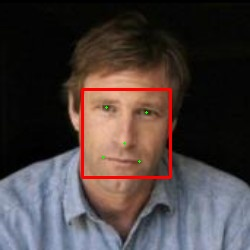
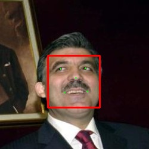
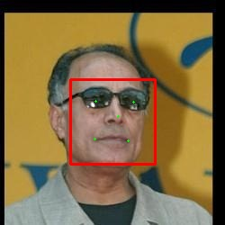
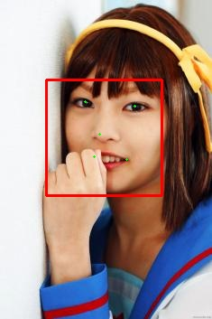
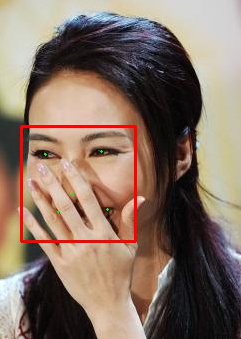

deep-landmark
=============

Predict facial landmarks with Deep CNNs powered by Caffe.

This project is a reimplementation of the paper Deep Convolutional Network Cascade for Facial Point Detection.

### Data

All training data can be downloaded from [here](http://mmlab.ie.cuhk.edu.hk/archive/CNN_FacePoint.htm).

Download the images and extract to `dataset` with `train` and `test`.

modify `level1.py, level2.py, level3.py` under `dataset` to change to training datasets.

### Train

```
./bootstrap.sh
```

This will first generate prototxt files for caffe models and convert training data(images and landmarks) into h5 files. Then We will train the level-1 CNNs and use the result to generate training data for level-2. And for level-2 and level-3 goes the same way.

I **strongly** suggest you to train every CNN seperately. It's every important to view the loss at first to see if it is stable, if not, stop the training and **restart**.

### View Trainging Logs

~~I have modified Caffe source code to log the test loss over every test, and I write `view_loss.py` to plot the loss, all log file are under `log` so as plot. If the loss plot is unusual, retraining the CNN model is needed.~~

Caffe will log all stuffs during the network training, you can find the log file under `/tmp` or you can give Caffe a hit where to save the log file. If you want to see the training
 loss curve, you should write a program to parse the log file yourself.

### Models

All model files are under `model`, we can modify `*.template` file to change the caffe network structure for every level.

### Results

I have created a web page to test the project, all code are under `webapp`.

##### error of every landmark in Level-3


##### some test








##### video test

https://youtu.be/oNiAtu0erEk

### References

1. [Caffe](http://caffe.berkeleyvision.org/)
2. [Deep Convolutional Network Cascade for Facial Point Detection](http://mmlab.ie.cuhk.edu.hk/archive/CNN_FacePoint.htm)
